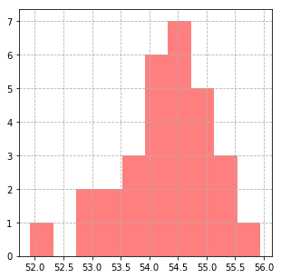
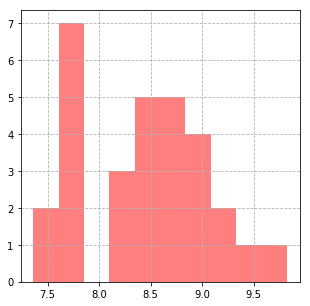
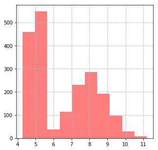
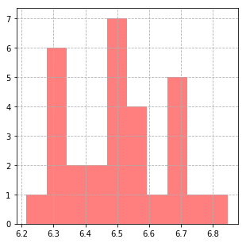
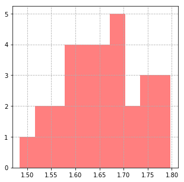

### Questions

### Objectives
YWBAT 
* apply the clt to find the mean and std of a population
* define the clt
* use sampling to find sampling statistics

### Outline
* Watch Mr. Nystrom
* Make some data
* apply clt to find stats on our data


```python
import pandas as pd
import numpy as np

import scipy.stats as scs

import matplotlib.pyplot as plt

np.random.seed(42)
```


```python
def make_hist(arr):
    plt.figure(figsize=(5, 5))
    plt.grid(linestyle='dashed')
    plt.hist(arr, color='r', alpha=0.5)
    plt.show()
```

## Create some data


```python
# height of a population
# we don't know what our data is
loc = np.random.randint(48, 72)
scale = np.random.randint(5, 9)
popsize = np.random.randint(1000, 1500)
pop = np.random.normal(loc=loc, scale=scale, size=popsize)
```

### Calculate the population mean (with some certainty) using sampling distributions


```python
sample_means = []
for i in range(30):
    samp = np.random.choice(pop, size=100, replace=False)
    sample_means.append(samp.mean())
```


```python
plt.figure(figsize=(5, 5))
plt.grid(linestyle='dashed')
plt.hist(sample_means, color='r', alpha=0.5)
plt.show()
```





```python
# how do we test for normality?
scs.skew(sample_means), scs.kurtosis(sample_means, fisher=False)
```


    (-0.7136669566700377, 3.8101325840693745)


```python
print(np.mean(sample_means) - 3*np.std(sample_means), np.mean(sample_means) + 3*np.std(sample_means))
```

    51.79585182468757 56.739289606174104


```python
np.mean(sample_means)
```


    54.267570715430836


### How do we calculate the population standard deviation?


```python
sample_stds = []
for i in range(30):
    samp = np.random.choice(pop, size=100, replace=False)
    sample_stds.append(samp.std())
```


```python

plt.figure(figsize=(5, 5))
plt.grid(linestyle='dashed')
plt.hist(sample_stds, color='r', alpha=0.5)
plt.show()
```





```python
scs.skew(sample_stds), scs.kurtosis(sample_stds, fisher=False)
```


    (0.07491090271341218, 2.2486691017922027)


```python
print(np.mean(sample_stds) - 3*np.std(sample_stds), np.mean(sample_stds) + 3*np.std(sample_stds))
```

    6.627438005035517 10.250677641064202


```python
np.mean(sample_stds)
```


    8.43905782304986


```python
# spread of our sampling means? 
np.mean(sample_stds) / 10
```


    0.8439057823049859


### Verifying if our sampling estimated our mean/std correctly...
It did


```python
np.mean(sample_means), pop.mean()
```


    (54.267570715430836, 54.254315264939486)


```python
np.mean(sample_stds), pop.std()
```


    (8.43905782304986, 8.439896288978073)


### Does our population need to be normal?


```python
# hours of sleep students get at flatiron
students = np.random.normal(5, 0.2, size=1000)

# hours of sleep employees get at flatiron
employees = np.random.normal(8, 1.0, size=1000)
```


```python
all_flatiron = np.concatenate([students, employees])
all_flatiron.shape
```


    (2000,)


```python
make_hist(all_flatiron)
```





```python
sample_means = []
sample_stds = []

for i in range(30):
    samp = np.random.choice(all_flatiron, size=100)
    sample_means.append(np.mean(samp))
    sample_stds.append(np.std(samp))
```


```python
make_hist(sample_means)
make_hist(sample_stds)
```








```python
np.mean(all_flatiron), np.mean(sample_means)
```


    (6.506361834201236, 6.494152262884501)


```python
np.std(all_flatiron), np.mean(sample_stds)
```


    (1.6728808853851138, 1.6536313679786818)


```python
# What if we took a sample of people and got a mean of 7.0
# What is the probability that the sample came from flatiron?
mu = 7.0
```


```python
scs.ttest_1samp(sample_means, 7.0)
```


    Ttest_1sampResult(statistic=-16.993119437706515, pvalue=1.2900103036426018e-16)


### Assessment
